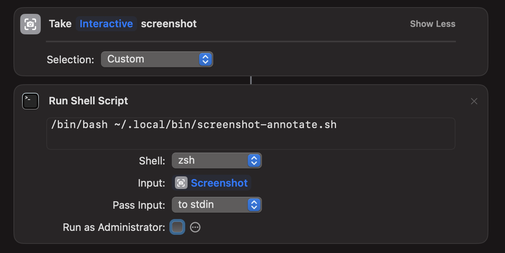

# Screenshot Annotate

Screenshot-and-annotate workflow triggered via **Cmd+Shift+2** through Raycast.

## How it works

An Apple Shortcut ("AnnotateScreenshot") orchestrates two steps:



1. **Take Interactive screenshot** — uses the macOS Shortcuts "Take Screenshot" action with Custom selection, letting you drag a region on screen.
2. **Run Shell Script** — pipes the screenshot PNG to `~/.local/bin/screenshot-annotate.sh` via stdin.

The bash script then:

- Saves the PNG to `~/Downloads/screenshots/` with a timestamp filename.
- Opens it in Preview and activates the annotation toolbar (Cmd+Shift+A).
- Waits for Preview to close (user annotates and saves with Cmd+S, then closes).
- Copies the final image to the clipboard.
- If the screenshot step was cancelled (empty file), cleans up and exits silently.

## Setup

1. **Install the script:**
   ```
   mkdir -p ~/Downloads/screenshots ~/.local/bin
   cp scripts/screenshot-annotate.sh ~/.local/bin/screenshot-annotate.sh
   chmod +x ~/.local/bin/screenshot-annotate.sh
   ```

2. **Create the Apple Shortcut** named "AnnotateScreenshot" with:
   - "Take Interactive screenshot" (Selection: Custom)
   - "Run Shell Script" — command: `/bin/bash ~/.local/bin/screenshot-annotate.sh`, Shell: zsh, Input: Screenshot, Pass Input: to stdin

3. **Raycast** — bind the shortcut to Cmd+Shift+2.

4. **macOS permissions** (System Settings > Privacy & Security):
   - Accessibility: Shortcuts app, Shortcuts Events
   - Screen Recording: Shortcuts app

The screenshot capture lives in the Shortcut (not the bash script) because giving bash direct screen recording access is avoided.
